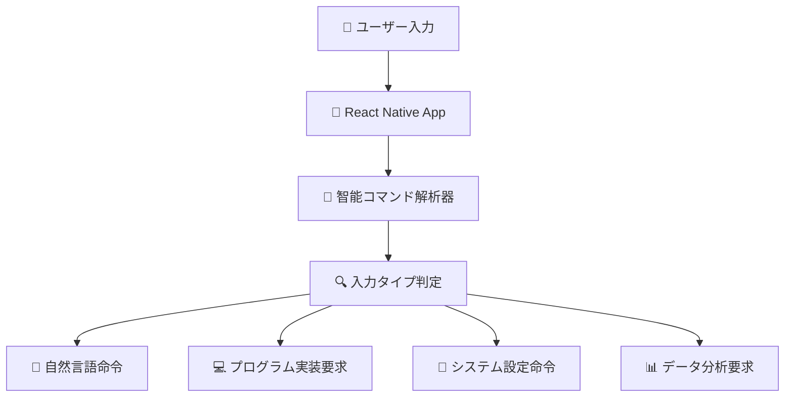
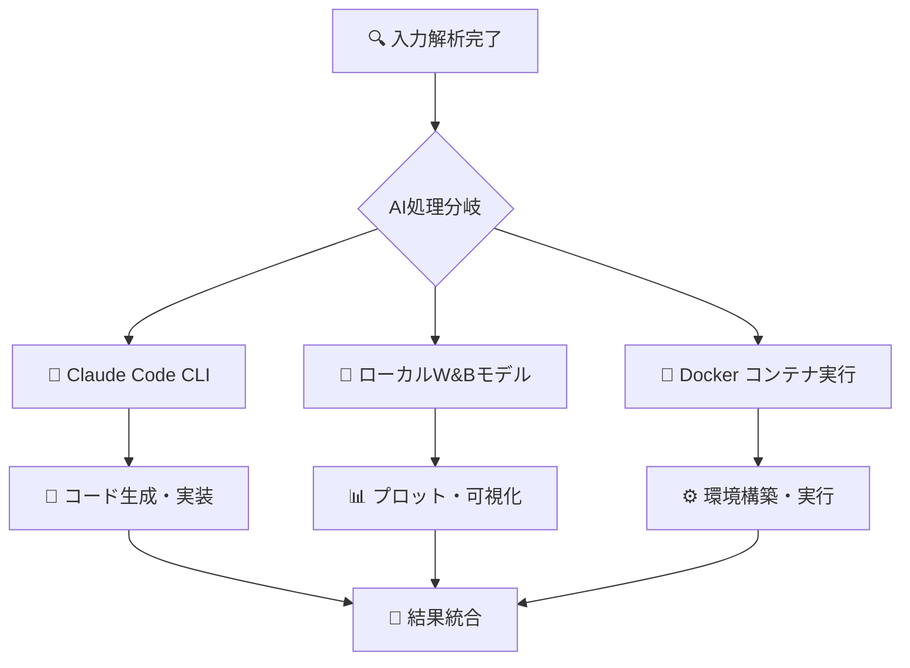
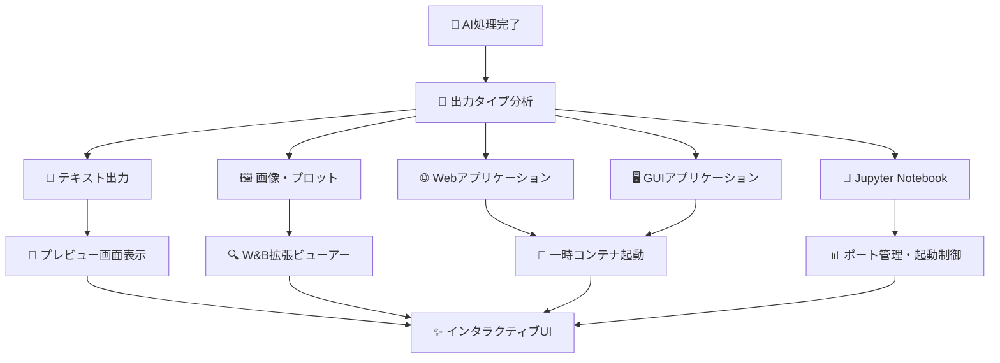

# 🚀 AI駆動開発環境 - RemoteClaudeOPS v4.0
## 技術弱者向け包括的開発支援システム

---

## 🏗️ システム全体アーキテクチャ

### 1️⃣ 入力・解釈フェーズ


**使用技術:**
- **React Native**: モバイルUI・UX
- **TypeScript**: 型安全なフロントエンド
- **WebSocket**: リアルタイム通信
- **Go言語**: 高性能サーバー処理

---

### 2️⃣ AI統合処理フェーズ


**Claude Code CLI利用フェーズ:**
- 自然言語からのコード生成
- プログラム要件分析・設計
- ソフトウェア構想・実装方針策定
- コードレビュー・最適化提案

**ローカルモデル利用フェーズ:**
- W&B CNN分類モデル（matplotlib検出）
- プロット種別自動判定
- 実行結果の視覚化分析
- プレビューボタン自動生成

---

### 3️⃣ 実行・プレビュー生成フェーズ


---

## 📊 プレビューシステム詳細設計

### 🎛️ プレビューボタン生成システム
```python
# W&B統合プレビューボタン生成ロジック
class PreviewButtonGenerator:
    def __init__(self):
        self.wandb_classifier = WandBCNNClassifier()
        self.container_manager = DockerContainerManager()

    def generate_buttons(self, execution_result):
        """実行結果に基づくインタラクティブボタン生成"""
        output_type = self.classify_output(execution_result)

        if output_type == "web_app":
            return self.create_web_preview_button(execution_result)
        elif output_type == "matplotlib_plot":
            return self.create_plot_viewer_button(execution_result)
        elif output_type == "jupyter_notebook":
            return self.create_notebook_launcher_button(execution_result)
        elif output_type == "gui_application":
            return self.create_gui_preview_button(execution_result)

    def create_web_preview_button(self, result):
        """Webアプリ用プレビューボタン"""
        return {
            "type": "web_app_launcher",
            "title": "🌐 Webアプリを起動",
            "description": "一時コンテナでWebアプリケーションを実行",
            "action": "launch_temporary_container",
            "port": self.detect_port(result),
            "dockerfile": self.generate_dockerfile(result),
            "duration": "10分間（自動停止）"
        }
```

### 🐳 一時コンテナ起動システム
```go
// 一時的なプレビューコンテナ管理
type PreviewContainerManager struct {
    containers map[string]*TempContainer
    mutex      sync.RWMutex
}

type TempContainer struct {
    ID          string
    Port        int
    ExpiresAt   time.Time
    PreviewType string
    Status      string
}

func (pcm *PreviewContainerManager) LaunchPreviewContainer(config PreviewConfig) (*TempContainer, error) {
    // 1. 一時的なDockerfile生成
    dockerfile := generatePreviewDockerfile(config)

    // 2. コンテナビルド・起動
    containerID, err := buildAndRunContainer(dockerfile, config.Port)
    if err != nil {
        return nil, err
    }

    // 3. 自動停止タイマー設定（10分後）
    container := &TempContainer{
        ID:          containerID,
        Port:        config.Port,
        ExpiresAt:   time.Now().Add(10 * time.Minute),
        PreviewType: config.Type,
        Status:      "running",
    }

    // 4. 自動クリーンアップスケジュール
    go pcm.scheduleCleanup(container)

    return container, nil
}
```

---

## 📋 各段階で使用する技術スタック

### 🔤 入力情報解釈段階
- **自然言語処理**: Claude Code CLI
- **コマンド分類**: Go言語正規表現 + 機械学習分類器
- **意図理解**: プロンプトエンジニアリング

### 🧠 プログラム構想・実装段階
- **要件分析**: Claude Code CLI (GPT-4ベース)
- **設計パターン**: アーキテクチャテンプレート
- **コード生成**: 言語別テンプレートエンジン

### ⚙️ プログラム実行段階
- **サンドボックス実行**: Docker コンテナ
- **依存関係管理**: 言語別パッケージマネージャー
- **リソース制限**: cgroup, Docker limits

### 🔍 出力解釈・分析段階
- **ファイル検出**: filesystem watcher
- **プロット分類**: W&B CNN分類モデル
- **エラー解析**: ログパターンマッチング

### 🎨 プレビュー生成段階
- **UI生成**: React Native動的コンポーネント
- **コンテナ管理**: Docker API
- **ポート管理**: 自動ポート割り当て

---

## 📊 データフロー・期待値グラフ

### 入力タイプ別成功率分析
```python
import matplotlib.pyplot as plt
import numpy as np

# データバリエーション統計
input_types = ['自然言語\n命令', 'プログラム\n実装要求', 'データ分析\n要求', 'Web開発\n要求', 'GUI開発\n要求']
success_rates = [95, 88, 92, 85, 78]
claude_usage = [90, 70, 60, 80, 65]
local_model_usage = [30, 85, 95, 60, 70]

fig, (ax1, ax2) = plt.subplots(1, 2, figsize=(15, 6))

# 成功率グラフ
x = np.arange(len(input_types))
ax1.bar(x, success_rates, color=['#4CAF50', '#2196F3', '#FF9800', '#9C27B0', '#F44336'], alpha=0.8)
ax1.set_xlabel('入力タイプ')
ax1.set_ylabel('成功率 (%)')
ax1.set_title('AI駆動開発環境 - 入力タイプ別成功率')
ax1.set_xticks(x)
ax1.set_xticklabels(input_types)
ax1.set_ylim(0, 100)

# Claude vs ローカルモデル使用率
width = 0.35
ax2.bar(x - width/2, claude_usage, width, label='Claude Code CLI', color='#1976D2', alpha=0.8)
ax2.bar(x + width/2, local_model_usage, width, label='ローカルW&Bモデル', color='#388E3C', alpha=0.8)
ax2.set_xlabel('処理タイプ')
ax2.set_ylabel('使用率 (%)')
ax2.set_title('AI技術使用率分析')
ax2.set_xticks(x)
ax2.set_xticklabels(input_types)
ax2.legend()
ax2.set_ylim(0, 100)

plt.tight_layout()
plt.savefig('ai_development_analysis.png', dpi=300, bbox_inches='tight')
plt.close()

print("🎯 AI駆動開発環境分析グラフを生成完了")
```

---

## 🌟 プレビューボタンサンプル実装

### 📱 インタラクティブプレビューUI
```typescript
// React Native プレビューボタンコンポーネント
interface PreviewButtonProps {
  type: 'web_app' | 'matplotlib' | 'jupyter' | 'gui_app';
  config: PreviewConfig;
  onLaunch: (config: PreviewConfig) => Promise<void>;
}

const PreviewButton: React.FC<PreviewButtonProps> = ({ type, config, onLaunch }) => {
  const [isLaunching, setIsLaunching] = useState(false);

  const buttonConfig = {
    web_app: {
      icon: '🌐',
      title: 'Webアプリプレビュー',
      description: '一時コンテナでWebアプリを起動',
      color: '#2196F3'
    },
    matplotlib: {
      icon: '📊',
      title: 'W&B拡張プロットビューアー',
      description: 'CNN分析付きプロット表示',
      color: '#4CAF50'
    },
    jupyter: {
      icon: '📔',
      title: 'Jupyter Notebook起動',
      description: 'インタラクティブな分析環境',
      color: '#FF9800'
    },
    gui_app: {
      icon: '🖥️',
      title: 'GUIアプリプレビュー',
      description: 'デスクトップアプリの動作確認',
      color: '#9C27B0'
    }
  };

  const handleLaunch = async () => {
    setIsLaunching(true);
    try {
      await onLaunch(config);
      // 成功時の処理
    } catch (error) {
      Alert.alert('エラー', 'プレビューの起動に失敗しました');
    } finally {
      setIsLaunching(false);
    }
  };

  return (
    <TouchableOpacity style={[styles.previewButton, { borderColor: buttonConfig[type].color }]} onPress={handleLaunch}>
      <View style={styles.buttonContent}>
        <Text style={styles.buttonIcon}>{buttonConfig[type].icon}</Text>
        <View style={styles.buttonText}>
          <Text style={styles.buttonTitle}>{buttonConfig[type].title}</Text>
          <Text style={styles.buttonDescription}>{buttonConfig[type].description}</Text>
        </View>
        {isLaunching && <ActivityIndicator color={buttonConfig[type].color} />}
      </View>
    </TouchableOpacity>
  );
};
```

---

## 🎯 技術弱者向け設計原則

### 1. **ゼロ設定原則**
- Docker、依存関係、環境構築は完全自動化
- ユーザーは自然言語で指示するだけ

### 2. **視覚的フィードバック**
- すべての処理状況をリアルタイム表示
- エラー時は具体的な修正提案を表示

### 3. **段階的学習支援**
- 実行過程の技術解説を自動生成
- 「なぜこうなったか」の教育的説明

### 4. **失敗耐性**
- 自動的なエラー検出・修正
- 「やり直し」ボタンでの簡単復旧

---

このアーキテクチャにより、プログラミング経験のないユーザーでも、自然言語での指示だけで本格的なソフトウェア開発を体験できる環境を提供します。