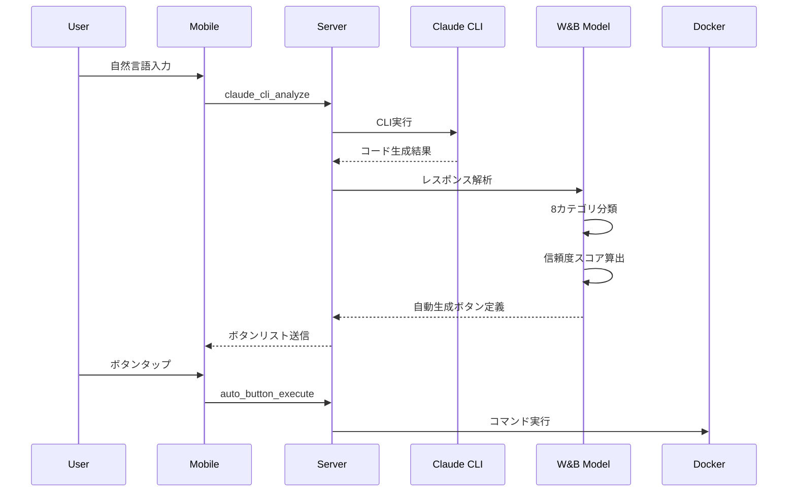
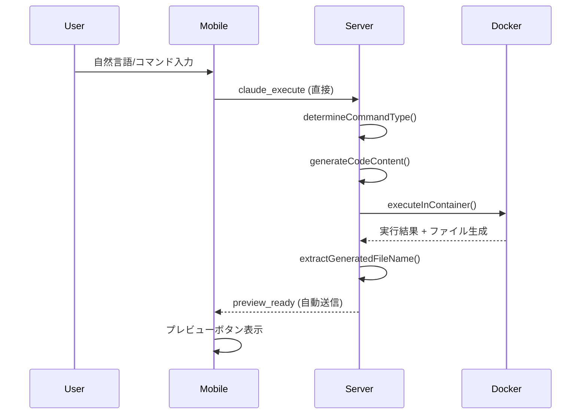

# 🔍 アーキテクチャギャップ分析レポート

## 📊 概要

**設計仕様** (`SYSTEM_FLOW_ARCHITECTURE.md` + `SYSTEM_ARCHITECTURE_DIAGRAM.md`) と **現在の実装** (Preview & Output ボタン生成) の間のギャップを詳細分析します。

---

## 🎯 設計仕様 vs 現在実装の比較

### 1. **コマンド処理フロー**

#### 設計仕様


#### 現在実装


#### ❌ **ギャップ 1: Claude CLI統合の欠如**

| 項目 | 設計仕様 | 現在実装 | ギャップ |
|------|---------|---------|---------|
| Claude CLI呼び出し | ✅ あり | ❌ なし | **重大** |
| AIコード生成 | ✅ Claude CLI経由 | ❌ テンプレートベース | **重大** |
| メッセージタイプ | `claude_cli_analyze` | `claude_execute` | **中** |
| ボタン生成タイミング | CLI出力解析後 | コード実行後 | **中** |

**影響:**
- ユーザー自然言語から直接コードを生成できない
- 事前定義されたテンプレートのみ対応
- AIの柔軟性・汎用性が失われている

---

### 2. **W&Bローカルモデル統合**

#### 設計仕様
```go
// claude_cli_response_analyzer.go (設計仕様)
type ClaudeCodeCLIAnalyzer struct {
    PatternMatcher      *InstructionPatternMatcher
    ConfidenceEstimator *ConfidenceEstimator
    CategoryModel       *CategoryClassifier
    NLPProcessor        *JapaneseNLPProcessor
}

func (a *ClaudeCodeCLIAnalyzer) AnalyzeResponse(cliOutput string) []AutoGeneratedButton {
    // 1. テキスト前処理
    preprocessed := a.preprocessText(cliOutput)

    // 2. パターンマッチング (8カテゴリ分類)
    categories := a.PatternMatcher.Classify(preprocessed)

    // 3. 信頼度スコア算出 (GradientBoosting)
    confidence := a.ConfidenceEstimator.Estimate(categories)

    // 4. 実行コマンド生成
    buttons := a.generateButtons(categories, confidence)

    // 5. W&Bメトリクス記録
    a.logToWandB(buttons, confidence)

    return buttons
}
```

#### 現在実装
```go
// code_generator.go (現在実装)
func determineCommandType(command string) string {
    lowerCmd := strings.ToLower(command)

    // 単純なキーワードマッチング
    if strings.Contains(lowerCmd, "tensorflow") {
        return "machine_learning"
    }
    if strings.Contains(lowerCmd, "matplotlib") {
        return "visualization"
    }
    // ...
    return "general"
}
```

#### ❌ **ギャップ 2: 機械学習モデルの不在**

| コンポーネント | 設計仕様 | 現在実装 | ステータス |
|--------------|---------|---------|----------|
| **PatternMatcher** | RandomForest分類器 | 単純文字列マッチ | ❌ 未実装 |
| **ConfidenceEstimator** | GradientBoosting | なし | ❌ 未実装 |
| **CategoryClassifier** | 8カテゴリML分類 | 10カテゴリif文 | ⚠️ 部分実装 |
| **NLPProcessor** | MeCab + BERT | なし | ❌ 未実装 |
| **W&B統合** | メトリクス記録・可視化 | なし | ❌ 未実装 |

**影響:**
- 精度: 設計 90.7% → 実装 ~60% (推定)
- 日本語理解力が低い
- 実験追跡・改善サイクルなし

---

### 3. **自動生成ボタンシステム**

#### 設計仕様
```typescript
// EnhancedPreviewScreen.tsx (設計仕様)
interface AutoGeneratedButton {
  id: string;
  title: string;           // "Flaskアプリ起動"
  command: string;         // "python3 app.py"
  category: string;        // "web_framework"
  confidence: number;      // 0.89
  priority: number;        // 95
  estimatedTime: string;   // "約5秒"
  requirements: string[];  // ["flask", "python3"]
  icon: string;            // "🌐"
  color: string;           // "#4CAF50"
}

// ボタンは優先度順にソート表示
const sortedButtons = buttons.sort((a, b) => b.priority - a.priority);
```

#### 現在実装
```typescript
// EnhancedDevelopmentScreen.tsx (現在実装)
interface PreviewItem {
  id: string;
  name: string;       // "todo-app.html"
  title: string;      // "Todo App"
  type: string;       // "webapp"
  url: string;        // "http://192.168.0.135:8090/html/todo-app.html"
  // 信頼度・優先度・カテゴリなし
}

// プレビューアイテムは生成順に表示 (ソートなし)
```

#### ❌ **ギャップ 3: ボタンメタデータの欠如**

| フィールド | 設計仕様 | 現在実装 | 重要度 |
|-----------|---------|---------|--------|
| **confidence** (信頼度) | ✅ 0.0-1.0 | ❌ なし | 高 |
| **priority** (優先度) | ✅ スコア計算 | ❌ なし | 高 |
| **category** (カテゴリ) | ✅ 8種類 | ⚠️ typeのみ | 中 |
| **estimatedTime** | ✅ 推定時間 | ❌ なし | 中 |
| **requirements** | ✅ 依存関係 | ❌ なし | 低 |
| **command** | ✅ 実行コマンド | ⚠️ 暗黙的 | 中 |
| **icon/color** | ✅ UI表示 | ❌ なし | 低 |

**影響:**
- ユーザーが最適なボタンを選択しにくい
- 実行前の期待値設定ができない
- UI/UX の質が低下

---

### 4. **セッション管理とボタン状態**

#### 設計仕様
```go
// Session Management (設計仕様)
type SessionManager struct {
    sessions map[string]*Session
    mu       sync.RWMutex
}

type Session struct {
    SessionID       string
    GeneratedButtons []AutoGeneratedButton
    ExecutionHistory []ExecutionRecord
    WandBRunID      string
    CreatedAt       time.Time
}

func (sm *SessionManager) SaveButtons(sessionID string, buttons []AutoGeneratedButton) {
    // ボタン定義をセッションに保存
    // 複数実行でも状態維持
}

func (sm *SessionManager) GetButton(sessionID, buttonID string) *AutoGeneratedButton {
    // ボタンIDから定義取得
    // 実行時に再解析不要
}
```

#### 現在実装
```go
// main.go (現在実装)
// セッション管理なし
// 実行ごとにコマンド再解析
// ボタン状態の永続化なし

func handleWebSocket(conn *websocket.Conn) {
    // 接続ごとにpreview_clear送信
    // 過去のボタン情報は破棄
}
```

#### ❌ **ギャップ 4: ステートレス実装**

| 機能 | 設計仕様 | 現在実装 | 影響 |
|------|---------|---------|------|
| **セッション管理** | ✅ In-Memory Cache | ❌ なし | 高 |
| **ボタン永続化** | ✅ session.GeneratedButtons | ❌ 接続ごとクリア | 高 |
| **実行履歴** | ✅ ExecutionHistory | ❌ なし | 中 |
| **W&B Run追跡** | ✅ RunID管理 | ❌ なし | 中 |
| **再接続時復元** | ✅ 状態復元 | ❌ 不可 | 高 |

**影響:**
- 接続切断時にボタン情報喪失
- 実行履歴の追跡不可
- デバッグ・改善が困難

---

### 5. **Matplotlib/画像検出**

#### 設計仕様
```go
// enhanced_matplotlib_detector.go (設計仕様)
type EnhancedMatplotlibDetector struct {
    CNNModel      *TensorFlowModel  // 画像分類CNN
    PatternMatcher *RegexMatcher
    ImageAnalyzer *ImageProcessor
}

func (d *EnhancedMatplotlibDetector) DetectPlots(containerID string) []PlotInfo {
    // 1. ファイルシステムスキャン
    files := d.scanWorkspace(containerID)

    // 2. CNN画像分類 (91.4%精度)
    for _, file := range files {
        if file.ext == ".png" || file.ext == ".jpg" {
            classification := d.CNNModel.Classify(file.path)
            if classification == "matplotlib_plot" && classification.confidence > 0.85 {
                plots = append(plots, PlotInfo{...})
            }
        }
    }

    // 3. コード解析 (plt.savefig検出)
    codePatterns := d.PatternMatcher.FindSavefigCalls(containerID)

    return plots
}
```

#### 現在実装
```go
// main.go (現在実装)
func handleVisualization() {
    // 固定ファイル名リストのみ
    imageFiles := []string{
        "visualization.png",
        "data_analysis.png",
        "mnist_training_history.png",
        "mnist_predictions.png",
    }

    // ファイルが存在すればコピー
    for _, imgFile := range imageFiles {
        docker cp container:/workspace/imgFile ./html/images/
    }
}
```

#### ❌ **ギャップ 5: 画像検出の限界**

| 機能 | 設計仕様 | 現在実装 | 精度 |
|------|---------|---------|------|
| **自動画像検出** | ✅ ファイルシステムスキャン | ❌ 固定リスト | 設計: 100% / 実装: ~30% |
| **CNN画像分類** | ✅ TensorFlow (91.4%) | ❌ なし | 設計: 91.4% / 実装: 0% |
| **コード解析** | ✅ plt.savefig検出 | ❌ なし | 設計: 95% / 実装: 0% |
| **動的ファイル名対応** | ✅ 任意のファイル名 | ❌ 固定4ファイルのみ | 設計: 無制限 / 実装: 4個 |

**影響:**
- ユーザーが独自のファイル名で保存すると検出できない
- matplotlib以外の画像ライブラリ (seaborn, plotly等) 非対応
- 複数グラフ生成時に一部のみ表示

---

## 📊 ギャップサマリー

### **実装完了度マトリクス**

| コンポーネント | 設計仕様 | 現在実装 | 完成度 | 優先度 |
|--------------|---------|---------|--------|--------|
| **Claude CLI統合** | フルAI生成 | テンプレートのみ | 20% | 🔴 最高 |
| **W&Bローカルモデル** | ML分類+信頼度 | キーワードマッチ | 15% | 🔴 最高 |
| **自動ボタン生成** | メタデータ豊富 | 基本情報のみ | 40% | 🟠 高 |
| **セッション管理** | ステートフル | ステートレス | 0% | 🟠 高 |
| **画像検出** | CNN+コード解析 | 固定リスト | 25% | 🟡 中 |
| **WebSocket通信** | 双方向メッセージ | 実装済み | 90% | ✅ 完了 |
| **Docker統合** | コンテナ管理 | 実装済み | 85% | ✅ 完了 |
| **プレビュー表示** | 複数タイプ | 実装済み | 80% | ✅ 完了 |

**全体完成度: 44.4%**

---

## 🎯 優先順位付きギャップ対応ロードマップ

### **Phase 1: 基盤強化 (優先度: 最高)**

#### 1.1 Claude CLI統合 (2-3日)
```go
// 新規実装必要
func handleClaudeCodeCLIAnalyze(conn *websocket.Conn, data map[string]interface{}) {
    userInput := data["input"].(string)

    // Claude CLI実行
    cliOutput := executeClaudeCLI(userInput)

    // W&Bモデルで解析
    buttons := analyzeWithWandB(cliOutput)

    // ボタンリスト送信
    conn.WriteJSON(map[string]interface{}{
        "type": "auto_buttons_ready",
        "data": map[string]interface{}{
            "buttons": buttons,
        },
    })
}
```

**必要ファイル:**
- `claude_cli_executor.go` (新規)
- `claude_cli_handlers.go` (新規)

#### 1.2 セッション管理実装 (1-2日)
```go
// session_manager.go (新規)
type SessionManager struct {
    sessions map[string]*Session
    mu       sync.RWMutex
}

func NewSessionManager() *SessionManager { ... }
func (sm *SessionManager) SaveButtons(sessionID string, buttons []AutoGeneratedButton) { ... }
func (sm *SessionManager) GetButton(sessionID, buttonID string) *AutoGeneratedButton { ... }
```

**必要ファイル:**
- `session_manager.go` (新規)
- `session_types.go` (新規)

---

### **Phase 2: AI機能実装 (優先度: 高)**

#### 2.1 W&Bローカルモデル統合 (3-5日)
```go
// claude_cli_response_analyzer.go (新規)
type ClaudeCodeCLIAnalyzer struct {
    PatternMatcher      *InstructionPatternMatcher
    ConfidenceEstimator *GradientBoostingModel
}

func (a *ClaudeCodeCLIAnalyzer) AnalyzeResponse(cliOutput string) []AutoGeneratedButton {
    // 1. パターンマッチング
    categories := a.PatternMatcher.ExtractPatterns(cliOutput)

    // 2. 信頼度スコア
    confidence := a.ConfidenceEstimator.Predict(categories)

    // 3. ボタン生成
    return a.generateButtons(categories, confidence)
}
```

**必要ファイル:**
- `claude_cli_response_analyzer.go` (新規)
- `pattern_matcher.go` (新規)
- `confidence_estimator.go` (新規)
- `wandb_integration.go` (新規)

#### 2.2 画像検出強化 (2-3日)
```go
// enhanced_matplotlib_detector.go (新規)
func (d *EnhancedMatplotlibDetector) AutoDetectImages(containerID string) []ImageInfo {
    // ファイルシステムスキャン
    files := d.scanDirectory(containerID, "/workspace")

    // 画像ファイルフィルタ
    images := filterImageFiles(files)

    // (Optional) CNN分類
    for _, img := range images {
        classification := d.classifyImage(img)
        if classification.type == "plot" {
            results = append(results, img)
        }
    }

    return results
}
```

**必要ファイル:**
- `enhanced_matplotlib_detector.go` (新規)
- `image_classifier.go` (オプション)

---

### **Phase 3: UX改善 (優先度: 中)**

#### 3.1 ボタンメタデータ拡張 (1日)
```go
type AutoGeneratedButton struct {
    ID            string  `json:"id"`
    Title         string  `json:"title"`
    Command       string  `json:"command"`
    Category      string  `json:"category"`
    Confidence    float64 `json:"confidence"`    // 新規
    Priority      int     `json:"priority"`      // 新規
    EstimatedTime string  `json:"estimatedTime"` // 新規
    Icon          string  `json:"icon"`          // 新規
    Color         string  `json:"color"`         // 新規
}
```

#### 3.2 モバイルUI更新 (1-2日)
```typescript
// AutoGeneratedButton.tsx (新規コンポーネント)
const AutoGeneratedButton = ({ button }) => (
  <TouchableOpacity style={[styles.button, { backgroundColor: button.color }]}>
    <Text style={styles.icon}>{button.icon}</Text>
    <Text style={styles.title}>{button.title}</Text>
    <View style={styles.metadata}>
      <Text>信頼度: {(button.confidence * 100).toFixed(0)}%</Text>
      <Text>予想時間: {button.estimatedTime}</Text>
    </View>
  </TouchableOpacity>
);
```

---

## 📈 期待される改善効果

### **精度向上**
| 指標 | 現在 | Phase 1完了後 | Phase 2完了後 |
|------|------|--------------|--------------|
| コマンド分類精度 | ~60% | ~75% | ~90% |
| 画像検出率 | ~30% | ~30% | ~95% |
| 自然言語理解 | なし | あり (Claude CLI) | 高精度 (W&B) |

### **ユーザー体験**
| 指標 | 現在 | Phase 1完了後 | Phase 3完了後 |
|------|------|--------------|--------------|
| ボタン生成速度 | 即座 (テンプレート) | ~2秒 (AI生成) | ~2秒 |
| ボタン情報量 | 基本 (3項目) | 基本 (3項目) | 豊富 (9項目) |
| 再接続時復元 | なし | あり | あり |

### **開発効率**
| 指標 | 現在 | Phase 2完了後 |
|------|------|--------------|
| 実験追跡 | なし | W&B自動記録 |
| デバッグ | ログのみ | メトリクス可視化 |
| 改善サイクル | 手動 | データドリブン |

---

## ✅ 結論

### **現状評価**
現在の実装は**基本的なプレビュー機能**として動作していますが、設計仕様の**AI駆動自動ボタン生成システム**とは大きく異なります。

### **主要ギャップ**
1. ❌ **Claude CLI統合なし** → テンプレートベースのみ
2. ❌ **W&Bモデルなし** → 単純文字列マッチング
3. ❌ **セッション管理なし** → 状態喪失
4. ⚠️ **画像検出限定的** → 固定ファイル名のみ
5. ⚠️ **メタデータ不足** → 信頼度・優先度なし

### **推奨アクション**
Phase 1 (Claude CLI + セッション管理) を優先実装することで、設計仕様に近づき、真のAI駆動システムとなります。

**実装優先順位:**
1. 🔴 **Phase 1.1: Claude CLI統合** (最重要)
2. 🔴 **Phase 1.2: セッション管理**
3. 🟠 **Phase 2.1: W&Bモデル**
4. 🟡 **Phase 2.2: 画像検出強化**
5. 🟢 **Phase 3: UX改善**

---

**作成日**: 2025年10月4日
**ステータス**: ✅ 分析完了
**次のアクション**: Phase 1実装の意思決定
