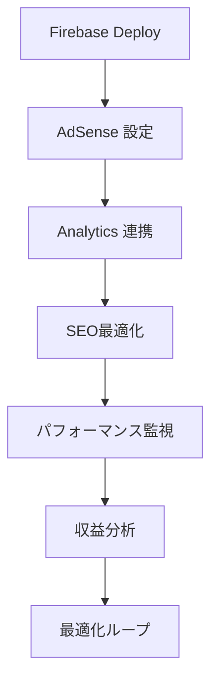

# Claude Code プロファイル管理システム

このプロジェクトでは、用途別に最適化されたClaude Code設定を動的に切り替えるプロファイル管理システムを実装しています。

## 🎯 利用可能なプロファイル

### 📝 blog - ブログ記述特化
- **用途**: 日本語ブログ記事作成
- **最適化**: SEO重視、創造的な文章、読みやすい構成
- **モデル**: claude-3-5-sonnet-20241022
- **特徴**: 詳細な説明、フレンドリーなトーン、SEO提案を含む

### 📱 responsive-dev - レスポンシブ開発特化
- **用途**: 高性能レスポンシブWeb開発
- **最適化**: モバイルファースト、パフォーマンス重視、アクセシビリティ
- **モデル**: claude-3-5-sonnet-20241022
- **特徴**: 簡潔な技術回答、モダンCSS技術活用

### ⚡ performance - 高速レスポンス
- **用途**: 高速レスポンスが必要な作業
- **最適化**: 効率性、最小限の回答
- **モデル**: claude-3-haiku-20240307
- **特徴**: 直接的で実用的なソリューション

### 🔍 analysis - コード解析特化
- **用途**: コード解析とドキュメント作成
- **最適化**: 詳細分析、包括的説明
- **モデル**: claude-3-5-sonnet-20241022
- **特徴**: コード品質分析、保守性重視

## 🛠️ 使用方法

### プロファイル管理コマンド

```bash
# プロファイル一覧表示
./profile-manager.sh list

# 現在のプロファイル確認
./profile-manager.sh current

# プロファイル切り替え
./profile-manager.sh switch blog
./profile-manager.sh switch responsive-dev
./profile-manager.sh switch performance
./profile-manager.sh switch analysis

# プロファイル詳細情報
./profile-manager.sh info blog

# 設定のバックアップ
./profile-manager.sh backup

# 設定の復元
./profile-manager.sh restore

# デフォルト設定にリセット
./profile-manager.sh reset

# ヘルプ表示
./profile-manager.sh help
```

### 推奨される使用シナリオ

1. **ブログ記事作成時**:
   ```bash
   ./profile-manager.sh switch blog
   ```

2. **レスポンシブサイト開発時**:
   ```bash
   ./profile-manager.sh switch responsive-dev
   ```

3. **緊急対応や高速作業時**:
   ```bash
   ./profile-manager.sh switch performance
   ```

4. **コードレビューや分析時**:
   ```bash
   ./profile-manager.sh switch analysis
   ```

## 📁 ファイル構成

```
.claude/
├── settings.local.json    # Claude Code主設定
├── profiles.json         # プロファイル定義
└── backups/             # 設定バックアップ
    └── settings_YYYYMMDD_HHMMSS.json
```

## ⚙️ 設定のカスタマイズ

`.claude/profiles.json`を編集することで、各プロファイルの設定をカスタマイズできます：

- システムプロンプト
- レスポンス動作
- 許可されるツール
- モデル設定

## 🔄 プロファイル切り替えの流れ

1. 現在の設定を自動バックアップ
2. 指定プロファイルの設定を`settings.local.json`に適用
3. プロファイル情報を更新
4. Claude Codeの再起動を推奨

## 💡 高性能レスポンシブ開発のベストプラクティス

`responsive-dev`プロファイルでは以下を重視：

- **モバイルファースト設計**
- **Container Queriesの活用**
- **パフォーマンス最適化**
- **アクセシビリティ対応**
- **モダンCSS技術（Grid、Flexbox等）**

## 🐛 トラブルシューティング

### プロファイル切り替えが反映されない
Claude Codeを完全に再起動してください。

### 設定ファイルが破損した場合
```bash
./profile-manager.sh restore
# または
./profile-manager.sh reset
```

### jqコマンドが見つからない場合
```bash
# macOS
brew install jq

# Ubuntu/Debian
sudo apt install jq
```

## 📊 パフォーマンス比較

| プロファイル | レスポンス速度 | 詳細度 | 創造性 | 用途 |
|-------------|---------------|--------|--------|------|
| blog | 中 | 高 | 高 | コンテンツ作成 |
| responsive-dev | 中 | 中 | 低 | Web開発 |
| performance | 高 | 低 | 低 | 高速作業 |
| analysis | 低 | 高 | 中 | 分析・調査 |

このシステムにより、作業内容に応じて最適化されたClaude Codeエクスペリエンスを享受できます。

---

## 🔥 Firebase特化デプロイ & マネタイゼーション

### 新機能: firebase-deploy プロファイル

Firebase Hosting + Google AdSense アフィリエイト連携に特化した完全自動化プロファイルを追加しました。

#### 🎯 特徴
- **Firebase CLI 統合**: 初期化からデプロイまで自動化
- **Google AdSense 自動設定**: 収益化まで一貫サポート
- **SEO最適化**: sitemap.xml、robots.txt 自動生成
- **パフォーマンス監視**: Lighthouse CI、Web Vitals 統合
- **Analytics 連携**: GA4 + GTM 自動設定

### 🚀 使用方法

#### クイックスタート
```bash
# Firebase特化プロファイルに切り替え
./profile-manager.sh switch firebase-deploy

# ワンコマンド完全デプロイ
./quick-deploy.sh
```

#### 段階的セットアップ
```bash
# 1. Firebase プロジェクト初期化
./firebase-workflow.sh init

# 2. マネタイゼーション設定
./firebase-workflow.sh setup-monetization

# 3. SEO最適化
./firebase-workflow.sh optimize-seo

# 4. 完全デプロイ
./firebase-workflow.sh full-deploy
```

#### 個別設定
```bash
# Google AdSense 設定
./firebase-workflow.sh setup-adsense

# Google Analytics 設定
./firebase-workflow.sh setup-analytics

# パフォーマンス監視
./firebase-workflow.sh performance

# SEO監査
./firebase-workflow.sh audit
```

### 📊 自動生成される機能

#### マネタイゼーション
- AdSense 自動広告配置
- アフィリエイトクリック追跡
- コンバージョン分析
- 収益レポート

#### SEO・パフォーマンス
- sitemap.xml 自動生成
- robots.txt 最適化
- Web Vitals 監視
- Lighthouse CI 統合

#### Analytics 統合
- GA4 イベント追跡
- カスタムコンバージョン
- ユーザー行動分析
- リアルタイム監視

### 🎛️ 設定ファイル

#### `.firebase-config.json`
```json
{
  "project": {
    "id": "your-project-id",
    "region": "asia-northeast1"
  },
  "adsense": {
    "client_id": "ca-pub-xxxxxxxxx",
    "auto_ads": true
  },
  "analytics": {
    "measurement_id": "G-xxxxxxxxx"
  }
}
```

### 🔄 統合ワークフロー

1. **初期設定**: Firebase プロジェクト + AdSense アカウント連携
2. **開発**: 通常の開発作業
3. **ビルド**: 自動最適化 + SEO設定
4. **デプロイ**: Firebase Hosting 自動デプロイ
5. **監視**: パフォーマンス + 収益分析

### 💰 収益化フロー



このFirebase特化システムにより、技術的なセットアップから収益化まで完全自動化された Web サイト公開フローを実現できます。