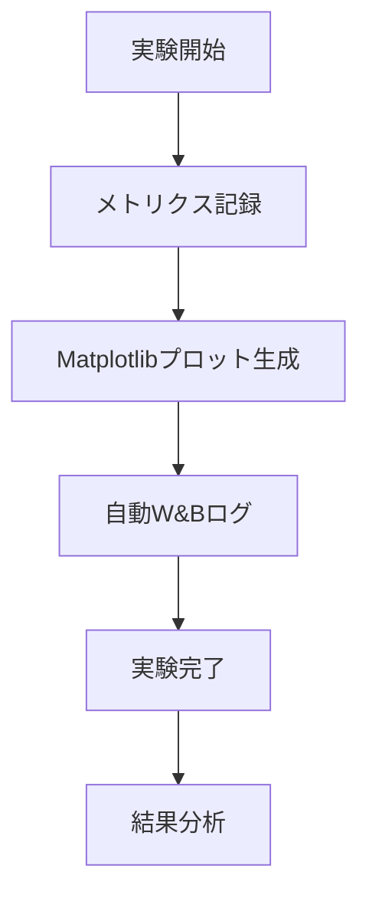

# RemoteClaudeOPS プロダクト仕様書 v4.0

## 📱 プロダクト概要

RemoteClaudeOPSは、リモート開発環境でのClaude AIとの統合を実現するiPhone/iPad用のモバイルアプリケーションです。ML/AI開発ワークフローにW&B (Weights & Biases)統合機能を追加し、実験管理と可視化を強化しました。

## 🎯 主要機能

### 1. リモート開発環境接続
- **WebSocket通信**: リアルタイムでサーバーと通信
- **複数サーバー管理**: 複数の開発環境を一元管理
- **自動再接続**: 接続が切断された場合の自動復旧機能
- **接続品質監視**: ping/pong による接続状態のリアルタイム監視

### 2. Enhanced Development Screen
- **インテリジェント入力**: TAB補完、コマンド履歴、矢印キーナビゲーション
- **リアルタイム実行**: Linuxコマンドの即座実行と結果表示
- **進捗追跡**: 実行段階の可視化とプログレス表示
- **エラーハンドリング**: 詳細なエラー情報とデバッグ支援

### 3. プレビュー機能 (Enhanced)
- **Matplotlibプロット表示**: 生成されたグラフの高品質表示
- **Webアプリケーションプレビュー**: ローカルWebアプリの統合表示
- **Jupyter Notebook連携**: ノートブック環境のネイティブサポート
- **フルスクリーン表示**: ズーム、パン操作対応

### 4. ⭐ W&B統合機能 (New in v4.0)
- **実験管理**: ML実験の開始、停止、状態追跡
- **自動ログ**: Matplotlibプロットの自動W&Bアップロード
- **メトリクス追跡**: 訓練メトリクス、損失、精度の記録
- **実験履歴**: 過去の実験結果の比較と分析
- **アーティファクト管理**: モデル、データセット、プロットの保存

### 5. Quick Commands
- **プリセットコマンド**: よく使用するコマンドのワンタップ実行
- **カスタマイズ**: ユーザー定義コマンドの追加・編集
- **カテゴリ管理**: コマンドの分類と整理
- **実行履歴**: コマンド実行の履歴管理

### 6. プロジェクト管理
- **プロジェクト一覧**: 複数プロジェクトの統合管理
- **Git統合**: ブランチ管理、コミット履歴表示
- **Docker支援**: コンテナ管理とログ監視
- **ファイル操作**: リモートファイルシステムへのアクセス

## 🏗️ アーキテクチャ

### フロントエンド (React Native + TypeScript)
```
RemoteClaudeApp/
├── src/
│   ├── components/          # 共通UI コンポーネント
│   ├── screens/            # 画面コンポーネント
│   │   ├── ProjectListScreen.tsx
│   │   ├── EnhancedDevelopmentScreen.tsx
│   │   ├── EnhancedPreviewScreen.tsx
│   │   └── QuickCommandsScreen.tsx
│   ├── services/           # ビジネスロジック
│   │   ├── EnhancedWebSocketService.ts
│   │   ├── WandBIntegrationService.ts    # ⭐ New
│   │   └── FirebaseConfigService.ts
│   └── types/              # TypeScript型定義
```

### バックエンド (Go + WebSocket)
```
server/
├── main.go                 # メインサーバー
├── remoteclaude-server-matplotlib-mgmt  # Matplotlib管理サーバー
├── docker-manager.go      # Docker統合
├── preview_manager.go      # プレビュー機能
└── project_management.go  # プロジェクト管理
```

## 🔄 W&B統合ワークフロー

### 1. 実験ライフサイクル


### 2. データフロー
```
iPhone App → WebSocket → Go Server → Docker Container → ML Code
     ↑                                                      ↓
W&B Dashboard ← W&B API ← WandBIntegrationService ← Matplotlib Plot
```

## 📊 技術仕様

### 対応プラットフォーム
- **iOS**: 14.0以上
- **iPadOS**: 14.0以上
- **React Native**: 0.72+
- **Expo**: SDK 49+

### 依存技術
- **WebSocket**: リアルタイム通信
- **React Navigation**: 画面遷移
- **Firebase**: 設定管理・分析
- **W&B API**: 実験管理・可視化
- **Docker**: コンテナ化開発環境

### パフォーマンス指標
- **接続確立時間**: <3秒
- **コマンド実行応答**: <5秒
- **プロット表示**: <2秒
- **W&B同期**: <10秒

## 🚀 新機能 (v4.0)

### W&B統合の詳細仕様

#### WandBIntegrationService.ts
```typescript
interface WandBExperiment {
  id: string;
  name: string;
  project: string;
  status: 'running' | 'completed' | 'failed';
  metrics: Record<string, number>;
  plots: WandBPlot[];
  artifacts: WandBArtifact[];
}
```

#### 主要メソッド
- `startExperiment()`: 新規実験開始
- `logMetrics()`: メトリクス記録
- `logPlot()`: プロット保存
- `logArtifact()`: アーティファクト管理
- `finishExperiment()`: 実験終了

#### Enhanced Preview Screen W&B Tab
- **実験状態表示**: 現在の実験情報とステータス
- **実験履歴**: 過去5件の実験リスト
- **メトリクス プレビュー**: 主要指標の概要表示
- **統合情報**: W&B連携の説明とガイド

## 🔧 セットアップ & 設定

### 開発環境
```bash
# フロントエンド
cd RemoteClaudeApp
npm install
npx expo start --ios

# バックエンド
cd server
go build -o remoteclaude-server main.go
./remoteclaude-server --port=8090
```

### W&B設定
```typescript
// W&B APIキーの設定
await wandbService.initialize('your-wandb-api-key');
```

## 📈 使用シナリオ

### ML研究者のワークフロー
1. **プロジェクト作成**: 新しいML実験プロジェクト開始
2. **W&B実験開始**: 実験追跡開始
3. **コード実行**: Enhanced Development Screen でPythonコード実行
4. **プロット生成**: Matplotlibで可視化作成
5. **自動ログ**: W&Bに結果自動保存
6. **結果分析**: Preview Screen で実験結果確認

### データサイエンティストの日常
1. **Quick Commands**: よく使うデータ処理コマンド実行
2. **Jupyter連携**: ノートブック環境での探索的分析
3. **リアルタイム監視**: 長時間訓練の進捗確認
4. **チーム共有**: W&B経由での結果共有

## 🛡️ セキュリティ & 品質

### セキュリティ機能
- **WebSocket認証**: セッションキーベースの認証
- **サンドボックス実行**: Docker コンテナでの安全な実行
- **ネットワーク暗号化**: WSS (WebSocket Secure) 対応

### 品質保証
- **TypeScript**: 型安全性による品質向上
- **エラーハンドリング**: 包括的なエラー処理
- **接続安定性**: 自動再接続とヘルスチェック
- **ログ管理**: 詳細なデバッグ情報

## 🔮 将来の拡張計画

### v5.0 計画機能
- **TensorBoard統合**: モデル可視化の追加
- **MLflow連携**: 実験管理プラットフォームの選択肢拡大
- **クラウド統合**: AWS/GCP/Azure との直接連携
- **チーム機能**: マルチユーザー対応

### パフォーマンス改善
- **バックグラウンド同期**: オフライン時の処理継続
- **キャッシュ最適化**: 頻繁にアクセスするデータの高速化
- **ストリーミング**: 大容量データの効率的転送

## 📋 リリースノート

### v4.0.0 (Current)
- ✅ W&B統合機能の完全実装
- ✅ Enhanced Preview Screen にW&Bタブ追加
- ✅ 自動実験ログ機能
- ✅ 実験履歴管理
- ✅ Matplotlib プロット自動保存

### v3.6.0
- ✅ Enhanced Development Screen の安定化
- ✅ Quick Commands の機能強化
- ✅ WebSocket接続の信頼性向上

## 📞 サポート & コントリビューション

### 開発チーム
- **プロジェクトリード**: RemoteClaudeOPS Team
- **技術スタック**: React Native, Go, Docker, W&B

### 問題報告
- **GitHub Issues**: バグ報告・機能要望
- **開発者ガイド**: コントリビューション手順

---

**Document Version**: v4.0
**Last Updated**: 2025年9月28日
**Status**: Production Ready with W&B Integration
**License**: MIT License