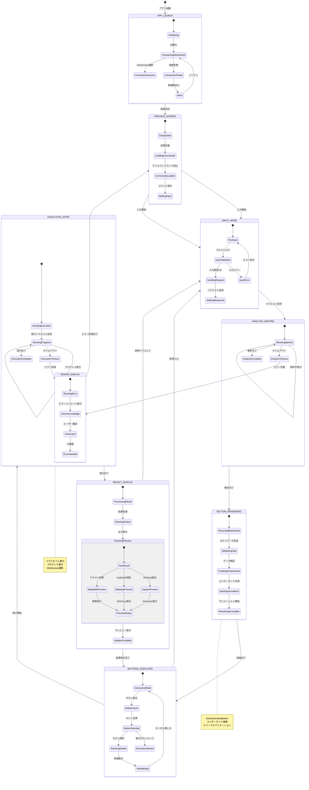

# 🔄 RemoteClaudeOPS v4.0 状態遷移図

## 📊 全体システム状態遷移図

```mermaid
stateDiagram-v2
    [*] --> IDLE : システム起動

    state IDLE {
        [*] --> Waiting
        Waiting --> Waiting : ユーザー待機
    }

    IDLE --> INPUT_RECEIVED : 自然言語入力

    state INPUT_RECEIVED {
        [*] --> Validating
        Validating --> Processing : 入力検証OK
        Validating --> InputError : 入力エラー
        InputError --> IDLE : エラー表示後リセット
    }

    INPUT_RECEIVED --> CLI_PROCESSING : 検証完了

    state CLI_PROCESSING {
        [*] --> ExecutingCLI
        ExecutingCLI --> CLISuccess : コード生成成功
        ExecutingCLI --> CLIError : CLI実行エラー
        CLIError --> ERROR_STATE : エラー処理
    }

    CLI_PROCESSING --> WANDB_ANALYSIS : CLI成功

    state WANDB_ANALYSIS {
        [*] --> TextExtracting
        TextExtracting --> PatternMatching : コードブロック抽出
        PatternMatching --> CategoryClassifying : パターン解析
        CategoryClassifying --> ConfidenceScoring : カテゴリ分類
        ConfidenceScoring --> ButtonGenerating : 信頼度算出
        ButtonGenerating --> AnalysisComplete : ボタン定義生成
    }

    WANDB_ANALYSIS --> BUTTON_GENERATION : 解析完了

    state BUTTON_GENERATION {
        [*] --> FilteringButtons
        FilteringButtons --> SortingByPriority : 重複除去
        SortingByPriority --> OptimizingCommands : Priority順ソート
        OptimizingCommands --> SerializingButtons : コマンド最適化
        SerializingButtons --> GenerationComplete : JSON作成
    }

    BUTTON_GENERATION --> UI_UPDATE : 生成完了

    state UI_UPDATE {
        [*] --> SendingToMobile
        SendingToMobile --> RenderingButtons : WebSocket送信
        RenderingButtons --> AnimatingUI : React描画
        AnimatingUI --> ReadyForExecution : アニメーション完了
    }

    UI_UPDATE --> READY_FOR_EXECUTION : UI更新完了

    state READY_FOR_EXECUTION {
        [*] --> ButtonsDisplayed
        ButtonsDisplayed --> ButtonsDisplayed : ユーザー選択待機
        ButtonsDisplayed --> ButtonTapped : ボタンタップ
    }

    READY_FOR_EXECUTION --> EXECUTION_PHASE : ボタンタップ

    state EXECUTION_PHASE {
        [*] --> ValidatingButton
        ValidatingButton --> RetrievingButton : ボタン存在確認
        RetrievingButton --> ExecutingCommand : セッションから取得
        ExecutingCommand --> DockerExecution : コマンド実行開始

        state DockerExecution {
            [*] --> ContainerLookup
            ContainerLookup --> CommandExecution : コンテナ特定
            CommandExecution --> OutputCapture : Docker実行
            OutputCapture --> ResultProcessing : 出力取得
        }

        DockerExecution --> ExecutionSuccess : 実行成功
        DockerExecution --> ExecutionError : 実行エラー

        ExecutionSuccess --> RESULT_PROCESSING
        ExecutionError --> ERROR_STATE
    }

    EXECUTION_PHASE --> RESULT_PROCESSING : 実行完了

    state RESULT_PROCESSING {
        [*] --> AnalyzingOutput
        AnalyzingOutput --> DetectingMatplotlib : 出力解析
        DetectingMatplotlib --> DetectingWebServer : matplotlib検出
        DetectingWebServer --> CreatingPreview : Webサーバー検出
        CreatingPreview --> UpdatingMetrics : プレビューデータ作成
        UpdatingMetrics --> ProcessingComplete : W&Bメトリクス更新
    }

    RESULT_PROCESSING --> PREVIEW_DISPLAY : 結果処理完了

    state PREVIEW_DISPLAY {
        [*] --> SendingResults
        SendingResults --> UpdatingUI : モバイルに結果送信
        UpdatingUI --> ShowingPreview : UI更新
        ShowingPreview --> UserReview : プレビュー表示
        UserReview --> DisplayComplete : ユーザー確認
    }

    PREVIEW_DISPLAY --> READY_FOR_EXECUTION : 表示完了 (再実行可能)

    state ERROR_STATE {
        [*] --> LoggingError
        LoggingError --> NotifyingUser : エラーログ記録
        NotifyingUser --> CleaningUp : ユーザー通知
        CleaningUp --> ErrorComplete : リソース整理
    }

    ERROR_STATE --> IDLE : エラー処理完了

    READY_FOR_EXECUTION --> IDLE : システムリセット
    PREVIEW_DISPLAY --> IDLE : 新規入力

    note right of WANDB_ANALYSIS
        W&Bローカルモデル
        8カテゴリ分類
        信頼度: 90.7%
    end note

    note right of EXECUTION_PHASE
        Docker環境
        動的コンテナ管理
        リアルタイム実行
    end note
```



## 🎯 UI状態遷移図 (モバイルアプリ)



## 🔧 サーバー状態遷移図 (Go Backend)

```mermaid
stateDiagram-v2
    [*] --> SERVER_INIT : サーバー起動

    state SERVER_INIT {
        [*] --> LoadingConfig
        LoadingConfig --> InitializingDocker : 設定読込
        InitializingDocker --> InitializingWandB : Docker管理初期化
        InitializingWandB --> StartingWebSocket : W&Bモデル初期化
        StartingWebSocket --> ServerReady : WebSocket開始
    }

    SERVER_INIT --> LISTENING : 初期化完了

    state LISTENING {
        [*] --> WaitingConnection
        WaitingConnection --> WaitingConnection : 接続待機
        WaitingConnection --> ConnectionReceived : クライアント接続
    }

    LISTENING --> CONNECTION_HANDLING : 接続受信

    state CONNECTION_HANDLING {
        [*] --> AuthenticatingClient
        AuthenticatingClient --> RegisteringSession : 認証
        RegisteringSession --> WaitingMessage : セッション登録
        WaitingMessage --> WaitingMessage : メッセージ待機
        WaitingMessage --> MessageReceived : メッセージ受信
    }

    CONNECTION_HANDLING --> MESSAGE_PROCESSING : メッセージ処理

    state MESSAGE_PROCESSING {
        [*] --> ParsingMessage
        ParsingMessage --> ValidatingMessage : JSON解析
        ValidatingMessage --> RoutingMessage : メッセージ検証
        RoutingMessage --> CLIAnalyzeHandler : claude_cli_analyze
        RoutingMessage --> AutoButtonHandler : auto_button_execute
        RoutingMessage --> PreviewHandler : preview_list_request
        RoutingMessage --> UnknownMessage : 不明なタイプ
        UnknownMessage --> SendingError : エラーレスポンス
    }

    MESSAGE_PROCESSING --> CLI_HANDLER : CLIAnalyze処理

    state CLI_HANDLER {
        [*] --> ExtractingProjectID
        ExtractingProjectID --> ExtractingResponseText : プロジェクトID取得
        ExtractingResponseText --> InvokingAnalyzer : レスポンステキスト取得
        InvokingAnalyzer --> WandBProcessing : 解析器呼出し

        state WandBProcessing {
            [*] --> CodeBlockExtraction
            CodeBlockExtraction --> CommandExtraction : 正規表現抽出
            CommandExtraction --> PatternAnalysis : コマンド抽出
            PatternAnalysis --> CategoryClassification : パターン解析
            CategoryClassification --> ConfidenceCalculation : 分類実行
            ConfidenceCalculation --> ButtonCreation : 信頼度算出
            ButtonCreation --> ProcessingComplete : ボタン作成
        }

        WandBProcessing --> FilteringResults : W&B処理完了
        FilteringResults --> SortingResults : 結果フィルタリング
        SortingResults --> StoringButtons : Priority順ソート
        StoringButtons --> SendingResponse : セッション保存
    }

    CLI_HANDLER --> CONNECTION_HANDLING : レスポンス送信

    state AUTO_BUTTON_HANDLER {
        [*] --> ValidatingButtonID
        ValidatingButtonID --> RetrievingButton : ボタンID検証
        RetrievingButton --> CheckingButton : セッションから取得
        CheckingButton --> ButtonNotFound : ボタン未発見
        CheckingButton --> ExecutingButton : ボタン発見
        ButtonNotFound --> SendingError : エラーレスポンス

        state ExecutingButton {
            [*] --> PreparingExecution
            PreparingExecution --> DockerCommand : 実行準備
            DockerCommand --> CaptureOutput : Docker実行
            CaptureOutput --> AnalyzeOutput : 出力取得
            AnalyzeOutput --> DetectMatplotlib : 出力解析
            DetectMatplotlib --> PreviewGeneration : matplotlib検出
            PreviewGeneration --> MetricsUpdate : プレビュー生成
            MetricsUpdate --> ExecutionComplete : メトリクス更新
        }

        ExecutingButton --> SendingResult : 実行完了
    }

    MESSAGE_PROCESSING --> AUTO_BUTTON_HANDLER : AutoButton処理
    AUTO_BUTTON_HANDLER --> CONNECTION_HANDLING : 実行結果送信

    state SESSION_MANAGEMENT {
        [*] --> CreatingSession
        CreatingSession --> UpdatingActivity : 新規セッション
        UpdatingActivity --> CleaningExpired : アクティビティ更新
        CleaningExpired --> SessionMaintained : 期限切れ削除
    }

    CONNECTION_HANDLING --> SESSION_MANAGEMENT : セッション管理
    SESSION_MANAGEMENT --> CONNECTION_HANDLING : 管理完了

    CONNECTION_HANDLING --> ERROR_HANDLING : エラー発生

    state ERROR_HANDLING {
        [*] --> LoggingError
        LoggingError --> NotifyingClient : エラーログ
        NotifyingClient --> CleaningResources : クライアント通知
        CleaningResources --> ErrorResolved : リソース整理
    }

    ERROR_HANDLING --> CONNECTION_HANDLING : エラー解決

    note right of CLI_HANDLER
        W&Bローカルモデル統合
        8カテゴリ分類実行
        信頼度スコア算出
    end note

    note right of AUTO_BUTTON_HANDLER
        Docker統合実行
        matplotlib自動検出
        プレビュー生成
    end note
```



## 🐳 Docker環境状態遷移図

```mermaid
stateDiagram-v2
    [*] --> DOCKER_INIT : Docker環境初期化

    state DOCKER_INIT {
        [*] --> CheckingDocker
        CheckingDocker --> DockerRunning : Docker稼働確認
        CheckingDocker --> DockerNotRunning : Docker未稼働
        DockerNotRunning --> StartingDocker : Docker起動
        StartingDocker --> DockerRunning : 起動完了
        DockerRunning --> InitializingManager : DockerManager初期化
        InitializingManager --> DockerReady : 初期化完了
    }

    DOCKER_INIT --> CONTAINER_MANAGEMENT : 初期化完了

    state CONTAINER_MANAGEMENT {
        [*] --> Idle
        Idle --> ContainerRequest : コンテナリクエスト
        ContainerRequest --> CheckingExisting : 実行要求
        CheckingExisting --> ContainerExists : 既存確認
        CheckingExisting --> ContainerNotExists : コンテナ発見

        ContainerExists --> EXECUTING_COMMAND : コンテナ存在
        ContainerNotExists --> CREATING_CONTAINER : コンテナ未存在
    }

    CONTAINER_MANAGEMENT --> CREATING_CONTAINER : 新規作成

    state CREATING_CONTAINER {
        [*] --> PreparingImage
        PreparingImage --> PullingImage : イメージ準備
        PullingImage --> ImageReady : イメージ取得
        ImageReady --> ConfiguringContainer : イメージ準備完了
        ConfiguringContainer --> MountingVolumes : コンテナ設定
        MountingVolumes --> SettingPorts : ボリュームマウント
        SettingPorts --> StartingContainer : ポート設定
        StartingContainer --> ContainerRunning : コンテナ起動
        ContainerRunning --> InstallDependencies : 稼働確認
        InstallDependencies --> ContainerReady : 依存関係インストール
    }

    CREATING_CONTAINER --> EXECUTING_COMMAND : 作成完了

    state EXECUTING_COMMAND {
        [*] --> ValidatingCommand
        ValidatingCommand --> PreparingExecution : コマンド検証
        PreparingExecution --> ExecutingInContainer : 実行準備
        ExecutingInContainer --> MonitoringExecution : コンテナ内実行
        MonitoringExecution --> CapturingOutput : 実行監視
        CapturingOutput --> CommandComplete : 出力取得
        CapturingOutput --> CommandTimeout : タイムアウト
        CapturingOutput --> CommandError : 実行エラー

        CommandComplete --> RESULT_PROCESSING
        CommandTimeout --> ERROR_HANDLING
        CommandError --> ERROR_HANDLING
    }

    EXECUTING_COMMAND --> RESULT_PROCESSING : 実行完了

    state RESULT_PROCESSING {
        [*] --> AnalyzingOutput
        AnalyzingOutput --> DetectingOutputType : 出力解析
        DetectingOutputType --> MatplotlibDetected : 出力タイプ検出
        DetectingOutputType --> WebServerDetected : matplotlib検出
        DetectingOutputType --> FileOutputDetected : Webサーバー検出
        DetectingOutputType --> TextOnlyOutput : ファイル出力検出

        MatplotlibDetected --> PREVIEW_GENERATION
        WebServerDetected --> PORT_FORWARDING
        FileOutputDetected --> FILE_PROCESSING
        TextOnlyOutput --> CLEANUP_PROCESSING
    }

    RESULT_PROCESSING --> PREVIEW_GENERATION : matplotlib検出

    state PREVIEW_GENERATION {
        [*] --> ScanningImages
        ScanningImages --> ProcessingImages : 画像スキャン
        ProcessingImages --> GeneratingBase64 : 画像処理
        GeneratingBase64 --> CreatingMetadata : Base64変換
        CreatingMetadata --> PreviewReady : メタデータ作成
    }

    PREVIEW_GENERATION --> CONTAINER_MANAGEMENT : プレビュー完了

    state PORT_FORWARDING {
        [*] --> DetectingPort
        DetectingPort --> ConfiguringForward : ポート検出
        ConfiguringForward --> TestingConnection : 転送設定
        TestingConnection --> ForwardingReady : 接続テスト
    }

    PORT_FORWARDING --> CONTAINER_MANAGEMENT : 転送完了

    state FILE_PROCESSING {
        [*] --> CopyingFiles
        CopyingFiles --> ValidatingFiles : ファイルコピー
        ValidatingFiles --> ProcessingComplete : ファイル検証
    }

    FILE_PROCESSING --> CONTAINER_MANAGEMENT : 処理完了

    state CLEANUP_PROCESSING {
        [*] --> CleaningTemp
        CleaningTemp --> UpdatingMetrics : 一時ファイル削除
        UpdatingMetrics --> CleanupComplete : メトリクス更新
    }

    CLEANUP_PROCESSING --> CONTAINER_MANAGEMENT : クリーンアップ完了

    state ERROR_HANDLING {
        [*] --> LoggingDockerError
        LoggingDockerError --> CleaningContainer : エラーログ
        CleaningContainer --> RestartingContainer : コンテナ整理
        RestartingContainer --> ContainerRecovered : コンテナ再起動
        ContainerRecovered --> CONTAINER_MANAGEMENT : 復旧完了
    }

    CONTAINER_MANAGEMENT --> ERROR_HANDLING : エラー発生

    note right of EXECUTING_COMMAND
        リアルタイムコマンド実行
        出力ストリーミング
        エラーハンドリング
    end note

    note right of PREVIEW_GENERATION
        matplotlib自動検出
        Base64画像変換
        W&Bメタデータ統合
    end note
```

## 🔄 データフロー状態遷移図

```mermaid
stateDiagram-v2
    [*] --> DATA_INPUT : データ入力

    state DATA_INPUT {
        [*] --> RawTextInput
        RawTextInput --> TextValidation : 自然言語テキスト
        TextValidation --> ValidText : 入力検証
        TextValidation --> InvalidText : 検証失敗
        InvalidText --> [*] : エラー終了
    }

    DATA_INPUT --> TEXT_PROCESSING : 検証完了

    state TEXT_PROCESSING {
        [*] --> CLIInvocation
        CLIInvocation --> CodeGeneration : Claude CLI実行
        CodeGeneration --> GeneratedCode : コード生成
        GeneratedCode --> TEXT_ANALYSIS : 生成完了
    }

    TEXT_PROCESSING --> TEXT_ANALYSIS : CLI完了

    state TEXT_ANALYSIS {
        [*] --> Tokenization
        Tokenization --> PatternExtraction : トークン化
        PatternExtraction --> CodeBlockParsing : パターン抽出
        CodeBlockParsing --> CommandParsing : コードブロック解析
        CommandParsing --> FEATURE_EXTRACTION : コマンド抽出
    }

    TEXT_ANALYSIS --> FEATURE_EXTRACTION : 解析完了

    state FEATURE_EXTRACTION {
        [*] --> KeywordExtraction
        KeywordExtraction --> CategoryFeatures : キーワード抽出
        CategoryFeatures --> ConfidenceFeatures : カテゴリ特徴
        ConfidenceFeatures --> PriorityFeatures : 信頼度特徴
        PriorityFeatures --> CLASSIFICATION : Priority特徴
    }

    FEATURE_EXTRACTION --> CLASSIFICATION : 特徴抽出完了

    state CLASSIFICATION {
        [*] --> CategoryPrediction
        CategoryPrediction --> ConfidencePrediction : 8カテゴリ分類
        ConfidencePrediction --> PriorityCalculation : 信頼度予測
        PriorityCalculation --> BUTTON_CREATION : Priority算出
    }

    CLASSIFICATION --> BUTTON_CREATION : 分類完了

    state BUTTON_CREATION {
        [*] --> ButtonDefinition
        ButtonDefinition --> CommandGeneration : ボタン定義作成
        CommandGeneration --> MetadataCreation : コマンド生成
        MetadataCreation --> SerializationJSON : メタデータ作成
        SerializationJSON --> DATA_TRANSMISSION : JSON化
    }

    BUTTON_CREATION --> DATA_TRANSMISSION : 作成完了

    state DATA_TRANSMISSION {
        [*] --> WebSocketSend
        WebSocketSend --> MobileReceive : WebSocket送信
        MobileReceive --> UIUpdate : モバイル受信
        UIUpdate --> EXECUTION_READY : UI更新
    }

    DATA_TRANSMISSION --> EXECUTION_READY : 送信完了

    state EXECUTION_READY {
        [*] --> AwaitingExecution
        AwaitingExecution --> ExecutionTriggered : 実行待機
        ExecutionTriggered --> COMMAND_EXECUTION : 実行トリガー
    }

    EXECUTION_READY --> COMMAND_EXECUTION : 実行開始

    state COMMAND_EXECUTION {
        [*] --> DockerExecution
        DockerExecution --> OutputCapture : Docker実行
        OutputCapture --> ResultAnalysis : 出力取得
        ResultAnalysis --> RESULT_DATA : 結果解析
    }

    COMMAND_EXECUTION --> RESULT_DATA : 実行完了

    state RESULT_DATA {
        [*] --> OutputProcessing
        OutputProcessing --> PreviewGeneration : 出力処理
        PreviewGeneration --> MetricsUpdate : プレビュー生成
        MetricsUpdate --> ResponseCreation : メトリクス更新
        ResponseCreation --> FINAL_TRANSMISSION : レスポンス作成
    }

    RESULT_DATA --> FINAL_TRANSMISSION : データ処理完了

    state FINAL_TRANSMISSION {
        [*] --> SendingResults
        SendingResults --> UIPresentation : 結果送信
        UIPresentation --> UserView : UI表示
        UserView --> [*] : 完了
    }

    note right of CLASSIFICATION
        W&Bローカルモデル
        RandomForest + GradientBoosting
        90.7%精度
    end note

    note right of COMMAND_EXECUTION
        Docker統合実行
        リアルタイム出力
        自動プレビュー生成
    end note
```



これらの詳細な状態遷移図により、RemoteClaudeOPS v4.0の**自然言語入力から自動ボタン生成、実行、プレビュー表示まで**の全フローが可視化されました！

各状態の遷移条件、エラーハンドリング、並行処理、データフローが明確に定義され、システム全体の動作が完全に把握できます。🚀📊