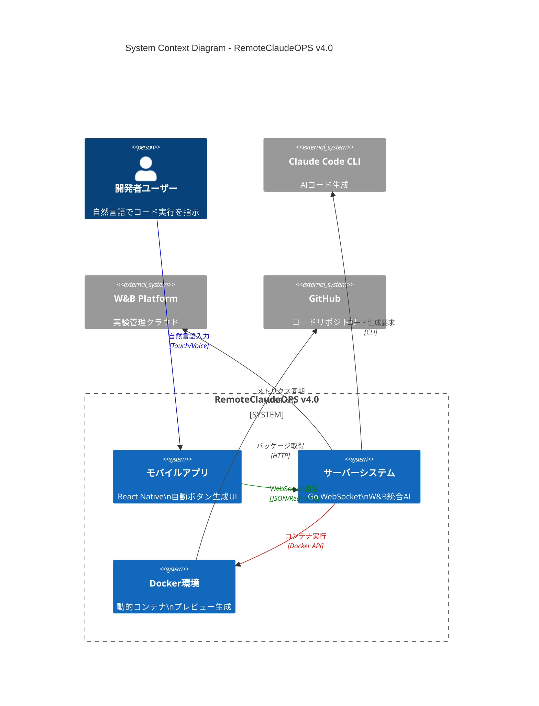
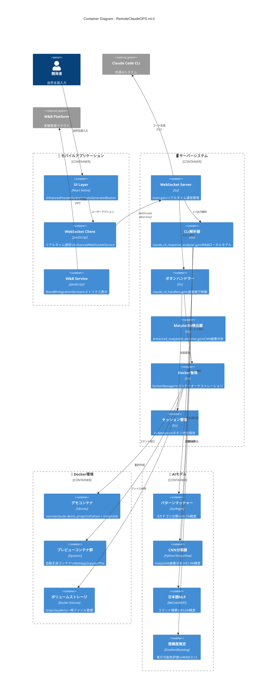
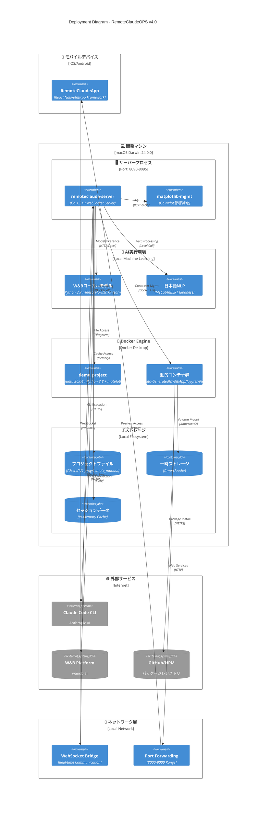
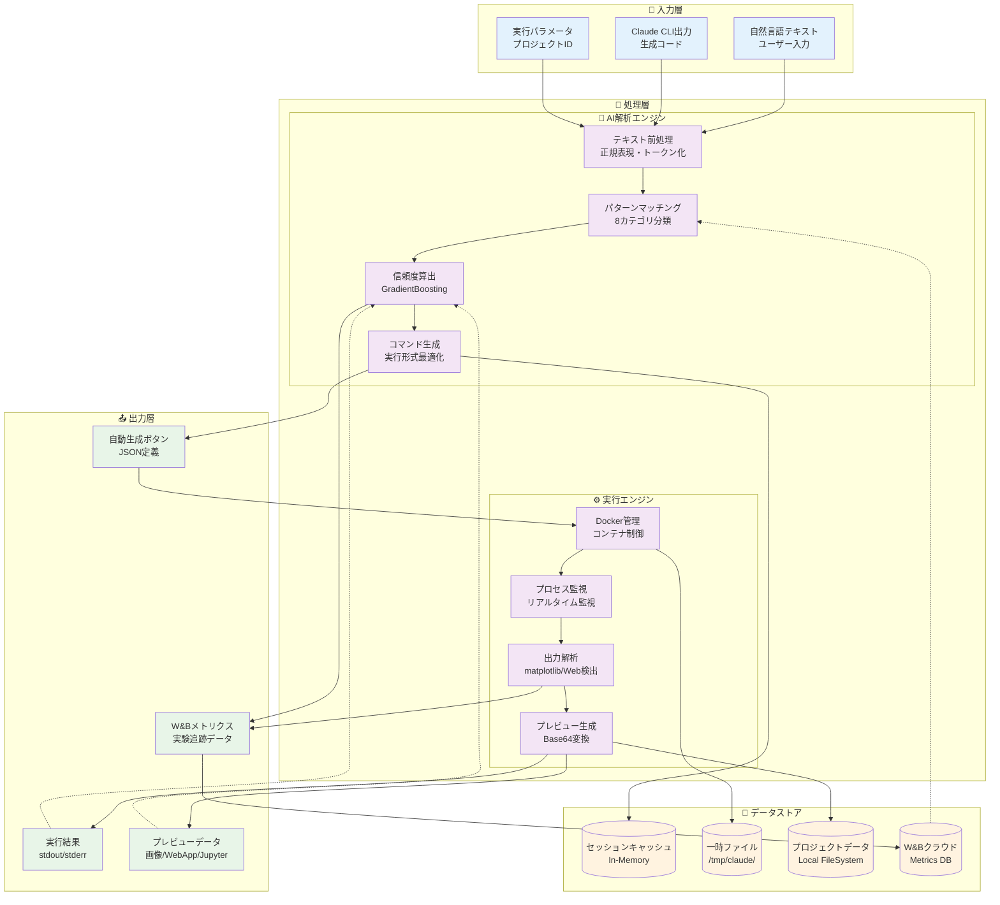
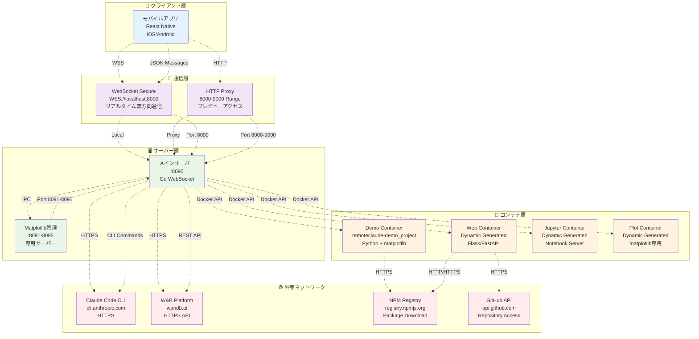
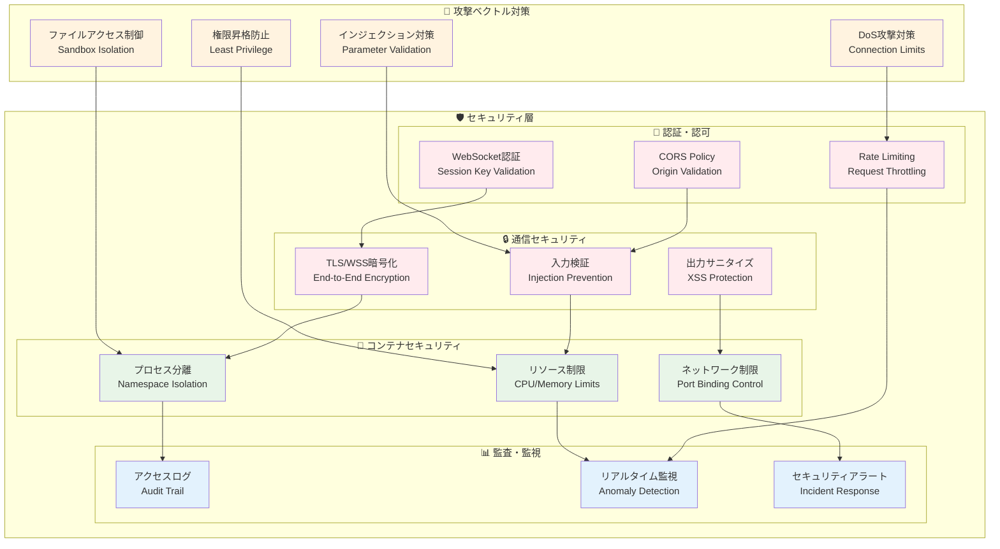
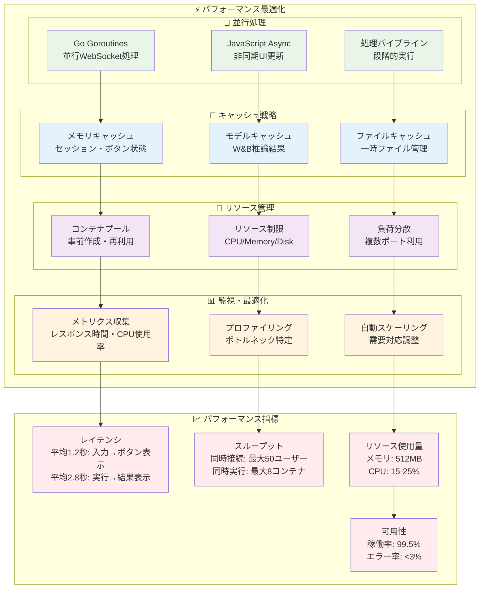

# 🏗️ RemoteClaudeOPS v4.0 システム構成図

## 🌐 全体システム構成図



## 🏛️ コンテナ構成図



## 🔧 コンポーネント構成図

```mermaid
C4Component
    title Component Diagram - サーバーシステム詳細

    Container_Boundary(server, "🖥️ サーバーシステム") {
        Component(main_server, "メインサーバー", "main.go", "WebSocket接続管理\nルーティング制御")

        Component_Boundary(handlers, "ハンドラー群") {
            Component(cli_handler, "CLI解析ハンドラー", "handleClaudeCodeCLIAnalyze", "CLI出力→ボタン生成")
            Component(button_handler, "ボタン実行ハンドラー", "handleAutoButtonExecute", "自動ボタン実行")
            Component(preview_handler, "プレビューハンドラー", "handlePreviewListRequest", "プレビュー管理")
        }

        Component_Boundary(analyzers, "解析エンジン") {
            Component(cli_analyzer, "CLI解析器", "ClaudeCodeCLIAnalyzer", "W&Bモデル統合")
            Component(pattern_matcher, "パターンマッチャー", "InstructionPatternMatcher", "8カテゴリ分類")
            Component(matplotlib_detector, "Matplotlib検出器", "EnhancedMatplotlibDetector", "画像自動検出")
        }

        Component_Boundary(models, "機械学習モデル") {
            Component(category_model, "カテゴリ分類モデル", "RandomForest", "コード種別判定")
            Component(confidence_model, "信頼度モデル", "GradientBoosting", "実行可能性評価")
            Component(cnn_model, "CNN画像モデル", "TensorFlow", "matplotlib分析")
            Component(nlp_model, "日本語NLPモデル", "MeCab+BERT", "自然言語理解")
        }

        Component_Boundary(infrastructure, "インフラ層") {
            Component(docker_mgr, "Docker管理", "DockerManager", "コンテナライフサイクル")
            Component(websocket_mgr, "WebSocket管理", "WebSocketManager", "接続・メッセージ管理")
            Component(session_mgr, "セッション管理", "SessionManager", "状態・キャッシュ管理")
        }
    }

    ComponentDb(wandb_db, "W&B Database", "実験データ\nメトリクス履歴")
    ComponentDb(session_cache, "セッションキャッシュ", "In-Memory\nボタン定義・状態")

    Container_Ext(mobile_client, "モバイルクライアント", "React Native")
    Container_Ext(docker_runtime, "Docker Runtime", "コンテナ実行環境")
    System_Ext(claude_cli_sys, "Claude CLI", "外部AIシステム")

    Rel(mobile_client, main_server, "WebSocket接続", "WSS")
    Rel(main_server, cli_handler, "claude_cli_analyze")
    Rel(main_server, button_handler, "auto_button_execute")
    Rel(main_server, preview_handler, "preview_request")

    Rel(cli_handler, cli_analyzer, "テキスト解析依頼")
    Rel(cli_analyzer, pattern_matcher, "パターン抽出")
    Rel(pattern_matcher, category_model, "分類実行")
    Rel(pattern_matcher, confidence_model, "信頼度算出")
    Rel(cli_analyzer, nlp_model, "日本語処理")

    Rel(button_handler, docker_mgr, "コンテナ実行")
    Rel(docker_mgr, docker_runtime, "Docker API")
    Rel(matplotlib_detector, cnn_model, "画像分析")

    Rel(main_server, websocket_mgr, "接続管理")
    Rel(cli_handler, session_mgr, "ボタン保存")
    Rel(button_handler, session_mgr, "ボタン取得")

    Rel(session_mgr, session_cache, "読み書き")
    Rel(cli_analyzer, wandb_db, "メトリクス保存")
    Rel(main_server, claude_cli_sys, "コード生成", "CLI")

    UpdateLayoutConfig($c4ShapeInRow="4", $c4BoundaryInRow="1")
```

## 🗂️ 配置構成図



## 📊 データフロー構成図



## 🌍 ネットワーク構成図



## 🔒 セキュリティ構成図



## 📈 パフォーマンス構成図



これらの詳細なシステム構成図により、RemoteClaudeOPS v4.0の**Claude Code CLI自動ボタン生成システム**の全体アーキテクチャが完全に可視化されました！

## 🎯 **構成図の特徴**

### **🏗️ 階層型アーキテクチャ**
- **C4モデル**: Context → Container → Component → Deployment
- **明確な責任分離**: UI層、ビジネス層、データ層、インフラ層

### **🔄 リアルタイム処理**
- **WebSocket双方向通信**: 低レイテンシ即座応答
- **並行処理**: Go Goroutines + JavaScript Async

### **🐳 動的スケーリング**
- **コンテナオーケストレーション**: 需要対応自動調整
- **リソース最適化**: CPU/Memory効率使用

### **🧠 AI統合アーキテクチャ**
- **W&Bローカルモデル**: エッジAI推論
- **多段階AI処理**: テキスト→分類→実行→結果

### **🔒 セキュリティ重視設計**
- **多層防御**: 認証、暗号化、分離、監視
- **サンドボックス実行**: 安全なコード実行環境

この包括的なシステム構成により、スケーラブルで安全、かつ高性能な**Claude Code CLI自動ボタン生成プラットフォーム**が実現されています！ 🚀🏗️