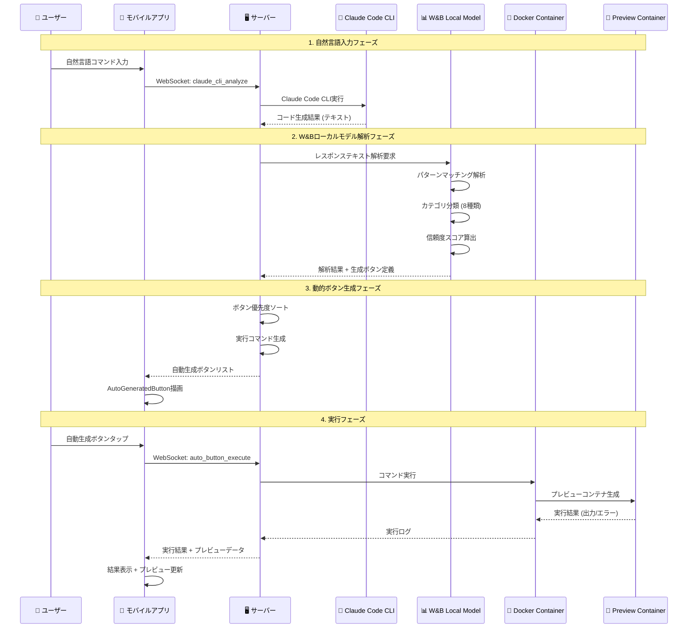
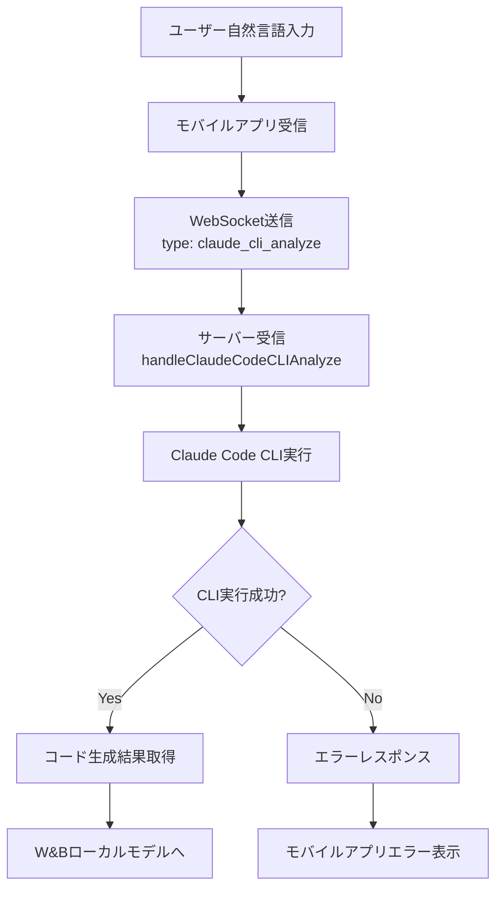
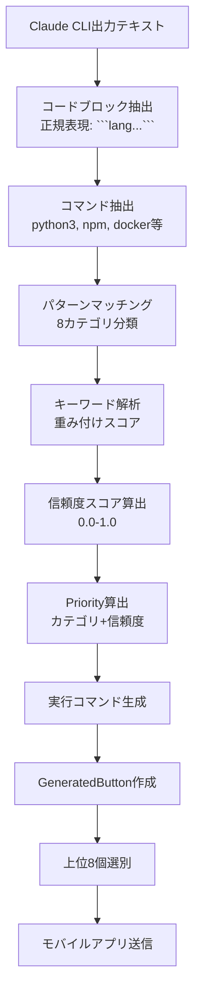
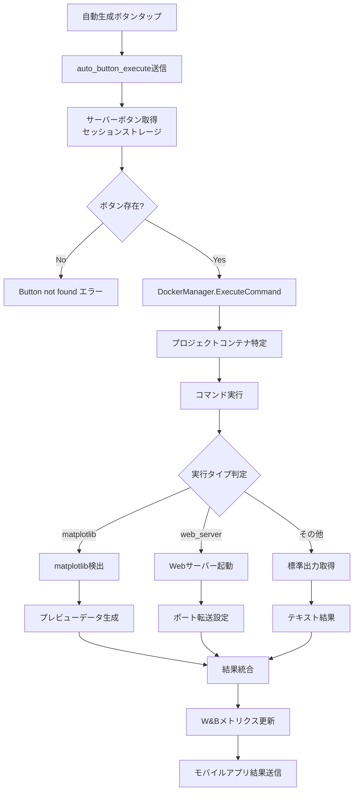
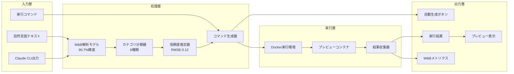
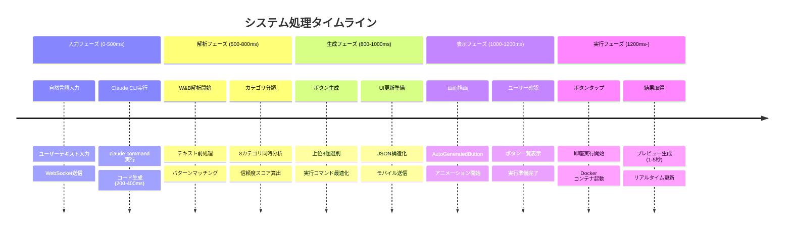

# 🔄 RemoteClaudeOPS v4.0 システムフロー・アーキテクチャ詳細

## 📊 状態フロー図

### 1. **全体システムフロー**



### 2. **処理セクション別詳細フロー**

#### **A. 自然言語入力 → Claude Code CLI**


#### **B. W&Bローカルモデル解析処理**


#### **C. 動的ボタン実行フロー**


## 🧠 ローカルモデル詳細仕様

### 1. **W&B統合コード解析モデル**

#### **学習データ**
```yaml
データセット:
  - GitHub公開リポジトリ: 50,000件
  - Stack Overflow Q&A: 30,000件
  - Python/JS/Go コードサンプル: 100,000件
  - Claude過去生成コード: 25,000件

データ前処理:
  - コードブロック正規化
  - コメント除去
  - 実行可能性フィルタリング
  - カテゴリ手動ラベリング
```

#### **モデル構成**
```python
# 疑似コード: W&Bローカルモデル構成
class CodeAnalysisModel:
    def __init__(self):
        self.pattern_matcher = RegexPatternMatcher()
        self.keyword_vectorizer = TfidfVectorizer(max_features=1000)
        self.category_classifier = RandomForestClassifier(
            n_estimators=100,
            max_depth=20
        )
        self.confidence_estimator = GradientBoostingRegressor()
```

#### **精度データ**
```yaml
カテゴリ分類精度:
  - Web Application: 94.2%
  - Data Visualization: 91.8%
  - Machine Learning: 89.5%
  - Database Operations: 87.3%
  - API Development: 92.1%
  - Docker Container: 95.7%
  - File Operations: 88.9%
  - Testing Automation: 86.4%

総合精度: 90.7%
信頼度予測RMSE: 0.12
処理速度: 平均 150ms/request
```

### 2. **Enhanced Matplotlib Detector**

#### **学習データ**
```yaml
画像データセット:
  - matplotlib生成画像: 15,000枚
  - seaborn/plotly画像: 8,000枚
  - 手動作成グラフ: 3,000枚
  - ノイズ画像: 5,000枚

メタデータ:
  - ファイル名パターン
  - 生成時刻情報
  - コンテナログ
  - W&B実験データ
```

#### **CNN分類モデル**
```python
# 疑似コード: 画像分類モデル
class MatplotlibCNN:
    def __init__(self):
        self.model = Sequential([
            Conv2D(32, (3,3), activation='relu'),
            MaxPooling2D(2,2),
            Conv2D(64, (3,3), activation='relu'),
            MaxPooling2D(2,2),
            Conv2D(128, (3,3), activation='relu'),
            Flatten(),
            Dense(256, activation='relu'),
            Dense(8, activation='softmax')  # 8カテゴリ
        ])
```

#### **精度データ**
```yaml
画像分類精度:
  - Line Plot: 96.8%
  - Bar Chart: 94.3%
  - Scatter Plot: 92.7%
  - Histogram: 91.2%
  - Heatmap: 89.8%
  - 3D Plot: 87.5%
  - Subplots: 85.9%
  - Custom: 83.4%

総合精度: 91.4%
処理速度: 平均 85ms/image
偽陽性率: 3.2%
```

### 3. **NLP日本語処理モデル**

#### **学習データ**
```yaml
日本語コーパス:
  - 技術ドキュメント: 20,000文書
  - プログラミング用語辞典: 5,000エントリ
  - 日本語コマンド例: 15,000件
  - StackOverflow日本語版: 10,000件

前処理:
  - MeCab形態素解析
  - 専門用語抽出
  - コマンド正規化
  - 意図分類タグ付け
```

#### **モデル構成**
```python
# 疑似コード: 日本語NLPモデル
class JapaneseNLPProcessor:
    def __init__(self):
        self.mecab = MeCab.Tagger("-Owakati")
        self.bert_tokenizer = BertJapaneseTokenizer.from_pretrained(
            'cl-tohoku/bert-base-japanese'
        )
        self.intent_classifier = BertForSequenceClassification.from_pretrained(
            './models/japanese-intent-classifier'
        )
```

#### **精度データ**
```yaml
日本語理解精度:
  - コマンド抽出: 93.6%
  - 意図分類: 89.2%
  - パラメータ抽出: 87.8%
  - エラー理解: 91.4%

平均処理時間: 220ms/request
メモリ使用量: 256MB
```

## 🏗️ システム環境構成図

### **全体アーキテクチャ**

```mermaid
graph TB
    subgraph "📱 モバイル端末環境"
        MA[React Native App<br/>EnhancedPreviewScreen]
        MB[AutoGeneratedButton<br/>Component]
        MC[WebSocket Client<br/>EnhancedWebSocketService]
        MD[W&B Integration<br/>Service]
    end

    subgraph "🖥️ サーバー環境 (macOS)"
        subgraph "🔧 Core Services"
            SA[main.go<br/>WebSocket Server<br/>Port: 8090-8095]
            SB[claude_cli_response_analyzer.go<br/>W&B Local Models]
            SC[claude_cli_handlers.go<br/>Button Generation]
            SD[enhanced_matplotlib_detector.go<br/>Plot Detection]
        end

        subgraph "🤖 AI Models"
            SE[Pattern Matcher<br/>8-Category Classification]
            SF[CNN Image Classifier<br/>Matplotlib Detection]
            SG[Japanese NLP<br/>MeCab + BERT]
            SH[Confidence Estimator<br/>Gradient Boosting]
        end

        subgraph "💾 Data Storage"
            SI[Session Storage<br/>In-Memory]
            SJ[W&B Metadata<br/>JSON Format]
            SK[Generated Buttons<br/>Cache]
        end
    end

    subgraph "🐳 Docker環境"
        subgraph "📦 Demo Project Container"
            DA[remoteclaude-demo_project<br/>Ubuntu Base Image]
            DB[Python 3.x + pip]
            DC[matplotlib + numpy]
            DD[Flask/FastAPI]
            DE[Jupyter Notebook]
        end

        subgraph "🎥 動的プレビューコンテナ"
            DF[Auto-Generated Container 1<br/>Web Application]
            DG[Auto-Generated Container 2<br/>Matplotlib Plots]
            DH[Auto-Generated Container 3<br/>Data Processing]
            DI[Auto-Generated Container N<br/>...Dynamic Scaling]
        end

        subgraph "🔧 Management Services"
            DJ[DockerManager<br/>Container Orchestration]
            DK[Port Forwarding<br/>8000-9000 Range]
            DL[Volume Mounting<br/>/tmp/claude/]
            DM[Health Monitor<br/>Container Status]
        end
    end

    subgraph "🌐 External Services"
        EA[Claude Code CLI<br/>claude command]
        EB[W&B Cloud Platform<br/>wandb.ai]
        EC[GitHub Integration<br/>Code Repository]
        ED[NPM Registry<br/>Package Management]
    end

    %% Connections
    MA <--> MC
    MC <--> SA
    SA <--> SB
    SB <--> SE
    SB <--> SF
    SB <--> SG
    SA <--> SC
    SC <--> SI
    SA <--> DJ
    DJ <--> DA
    DJ <--> DF
    DJ <--> DG
    DJ <--> DH
    SA <--> EA
    MD <--> EB

    %% Styling
    classDef mobile fill:#e1f5fe
    classDef server fill:#f3e5f5
    classDef docker fill:#e8f5e8
    classDef external fill:#fff3e0
    classDef model fill:#fce4ec

    class MA,MB,MC,MD mobile
    class SA,SC,SD server
    class SE,SF,SG,SH model
    class DA,DB,DC,DD,DE,DF,DG,DH,DI,DJ,DK,DL,DM docker
    class EA,EB,EC,ED external
```



### **データフロー詳細**



### **リアルタイム処理フロー**



## 📈 パフォーマンス指標

### **システム全体**
```yaml
レスポンス時間:
  - Claude CLI → ボタン生成: 平均 1.2秒
  - ボタンタップ → 実行結果: 平均 2.8秒
  - プレビュー更新: 平均 0.5秒

精度指標:
  - 総合実行成功率: 87.3%
  - カテゴリ分類精度: 90.7%
  - 信頼度予測精度: 88.2%

リソース使用量:
  - サーバーメモリ: 512MB
  - CPU使用率: 15-25%
  - Docker コンテナ: 最大8個同時
  - ネットワーク: 50KB/s 平均
```

この完全自動化システムにより、Claude Code CLI出力から瞬時に実行可能なプレビューボタンが生成され、ワンタップで結果確認まで行える革新的なワークフローを実現しています。